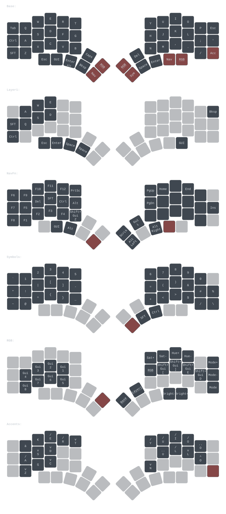

# Slovak Kyria keymap and firmware



The image above is generated from
[`vial_saves/v2_53_mo4_on_thumb.vil`](vial_saves/v2_53_mo4_on_thumb.vil):
the Base, Nav, and Sym layers are shown in that order.

This repository is the editable project layer for a Kyria rev1 using the
legacy Vial-QMK AVR firmware. The editable keyboard source lives under
`firmware/`. The first build creates an ignored `vial-qmk/` checkout at the
pinned source revision and copies the source into it before compiling.

## Quick start from Linux or WSL

The commands below run in a Linux or WSL terminal. They do not run in
PowerShell or `cmd.exe`; WSL is the Windows host contract for this project.

Clone the development branch with the repository's stable HTTPS identity:

```bash
git clone --branch firmware-dev-environment \
  https://KraXen72@github.com/KraXen72/slovak_kyria slovak_kyria
cd slovak_kyria
```

Install the small host prerequisite set once:

```bash
# Fedora / Fedora WSL
sudo dnf install -y curl git podman

# Debian or Ubuntu / WSL (use this instead of the Fedora command)
sudo apt-get update
sudo apt-get install -y curl git podman
```

Check the installation:

```bash
git --version
podman --version
podman info
```

Then, from the cloned repository:

```bash
bash infra/scripts/build.sh
```

That command pulls the pinned GHCR development image. If the image is not
available, it automatically builds the same
`infra/container/Containerfile` locally. The first run also clones the pinned
QMK checkout and initializes its submodules.

When the repository is under `/mnt/c` in WSL, the launcher stores the generated
QMK checkout in the persistent Podman volume `kyria-vial-qmk` instead of the
Windows filesystem. This keeps repeated builds usable. On a native Linux path,
the checkout is bind-mounted from the ignored `vial-qmk/` directory by default.

## Daily development

Open the project in VS Code from WSL with `code .`, or use any editor on the
outer repository. The canonical build commands work either from the WSL host
or from the integrated terminal in the development container:

```bash
bash infra/scripts/dev-shell.sh

# inside the development shell:
bash infra/scripts/build.sh
bash infra/scripts/verify.sh
```

The VS Code Dev Containers extension can use `.devcontainer.json` as an
optional convenience, but installing the devcontainer CLI is not required.
The scripts above are the portable Podman interface.

Edit these outer-repository files:

- `firmware/keymap.c`, `firmware/config.h`, `firmware/rules.mk`,
  `firmware/my_slovak_keymap.h`, and `firmware/altlocal_keys.def` are the
  firmware source copied into the generated QMK keymap.
- `firmware/vial.json` and `firmware/vial_encoders.json` are Vial metadata.
- `vial_saves/` contains saved Vial layouts.

`tools/` contains optional keymap helpers, `infra/` contains the container and
launcher implementation, and `docs/` contains project notes. The generated
QMK checkout is an implementation cache, not the source of truth for the
keymap. On WSL `/mnt/c` it is inside the named Podman volume; use
`KYRIA_USE_QMK_VOLUME=0` if you deliberately need the checkout visible on the
host.

## Git workflow

The development branch is `firmware-dev-environment`. Pull it before starting
work and push commits back to the same branch:

```bash
git pull --ff-only
git status
git add -A
git commit -m "describe the keymap change"
git push origin firmware-dev-environment
```

Build products, the generated QMK checkout, and local Python environments are
ignored. The committed firmware source, Vial saves, lockfile, and container
version contract are the reproducible inputs.

## Build outputs

Successful builds write these files under `build/`:

```text
build/splitkb_kyria_rev1_slovak_kyria.hex
build/splitkb_kyria_rev1_slovak_kyria.hex.sha256
build/splitkb_kyria_rev1_slovak_kyria.hex.info
```

The `.info` file records the keyboard, keymap, QMK repository and commit, QMK
CLI version, AVR compiler version, and firmware hash.

`verify.sh` performs two clean builds and compares them byte-for-byte. It also
compares a historical HEX if one is later added under
`reference/known-good/`; that artifact is not currently in this checkout.

## Recovery

The launcher uses the immutable image digest in
`infra/container/versions.env`. To pull that exact image explicitly:

```bash
podman pull ghcr.io/kraxen72/kyria-vial-legacy-dev@sha256:ed5089191a4f81d69caaad36c7d4fb83ae6c9efff6355eabc265325090bdea2d
```

When intentionally updating the toolchain image, update the digest in both
`infra/container/versions.env` and `.devcontainer.json` after the new image has
been published and tested. If the pinned image cannot be pulled, the launcher
uses the local tag `localhost/kyria-vial-legacy-dev:local` for its recovery
build.

The GHCR package must be public for a new machine to pull it without a login.
If it is intentionally private, authenticate once with a GitHub token that
has `read:packages` permission:

```bash
podman login ghcr.io
```

If the Linux-side QMK volume is corrupt, preserve or export anything useful,
then remove only that named cache and let the next build clone a fresh copy:

```bash
podman volume rm kyria-vial-qmk
bash infra/scripts/build.sh
```

For a native Linux bind-mounted checkout, move `vial-qmk/` aside instead. The
initializer never resets, fetches, switches, or deletes an existing QMK
checkout. It verifies the pinned commit and leaves local QMK work alone.

## Helper CLI

The optional helper uses `uv` and is separate from the firmware build. Install
`uv` on the WSL/Linux host if you need it:

The helper project targets Python 3.12+; uv provisions that interpreter and
uses the committed `uv.lock` file for its dependencies.

Install uv once if it is not already available:

```bash
curl -LsSf https://astral.sh/uv/install.sh | sh
source "$HOME/.local/bin/env"
uv --version
```

```bash
uv run --locked -m tools.helper --help
uv run --locked -m tools.helper fetchkeys
uv run --locked -m tools.helper genkey
uv run --locked -m tools.helper viltokey path/to/layout.vil
uv run --locked -m tools.helper vis \
  vial_saves/v2_53_mo4_on_thumb.vil \
  --layers 0,2,3 --layer-names Base,Nav,Sym
```

`vis` works offline from a committed Vial save and writes the companion
`keymap_latest.yaml`,
`keymap_latest.json`, and `keymap_latest.svg` files under `assets/` by default.
Visualization is not part of the firmware build or verification path. The
helper always reads and writes project files using their repository locations,
regardless of the current directory.

## Repository layout

```text
firmware/     editable keyboard firmware and Vial metadata
tools/        optional keymap/recovery helpers
infra/        Podman image, pinned build contract, and launcher scripts
assets/       committed visualizations used by the main README
docs/         notes and design records
reference/    recovery material and archived historical exports
.github/      image publishing workflow
```

## Source and recovery references

The firmware baseline and missing historical artifacts are documented in
[`reference/README.md`](reference/README.md). The retained Vial export most
closely associated with the recovery notes is
[`vial_saves/v2_36_restore_accents2.vil`](vial_saves/v2_36_restore_accents2.vil).

This setup does not dump, erase, or flash either controller. Those operations
remain separate, hardware-facing work.

## Credits

This started as a Slovak typing keymap by [precondition](https://github.com/precondition),
with the alt-local layout work from [Eric Gebhart](https://github.com/EricGebhart).
